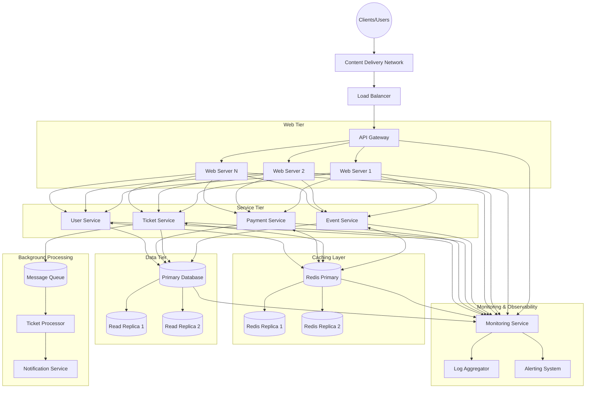

# Caching Strategy for Ticketing System

## Overview

Our ticketing system needs to handle thousands of concurrent users buying tickets for high-demand events. To achieve this, we've implemented a comprehensive caching strategy using Redis that addresses the critical performance bottlenecks in our system.



## Redis Caching Implementation

### 1. Event Data Caching

The most frequently accessed data in our system is event information. When users browse or search for events, we need to serve this data quickly:

- **Cache Strategy**: We use a read-through cache pattern for event data
- **Implementation**:
  - Key format: `event:{eventId}`
  - Value: Serialized JSON of event details
  - TTL: 1 hour for general event data; 10 minutes for events happening soon
  - Cache invalidation: We invalidate the cache when event details are updated

```javascript
async function getEvent(eventId) {
  const cachedEvent = await redisClient.get(`event:${eventId}`);
  if (cachedEvent) {
    return JSON.parse(cachedEvent);
  }
  
  const event = await database.getEvent(eventId);
  
  const ttl = isEventSoon(event) ? 600 : 3600;
  await redisClient.set(`event:${eventId}`, JSON.stringify(event), 'EX', ttl);
  
  return event;
}
```

This function implements a read-through cache pattern for event data. It first checks Redis for cached event information and returns it if found. If not in cache, it retrieves from the database and stores in Redis with a TTL that's shorter for imminent events.

### 2. Ticket Availability Caching

Ticket availability data is both read-heavy (users checking seat maps) and write-heavy (users reserving seats):

- **Cache Strategy**: Redis Sorted Sets for available tickets
- **Implementation**:
  - Key format: `tickets:available:{eventId}`
  - Value: Sorted set where members are ticketIds and scores can be seat numbers
  - Whenever a ticket is reserved, we remove it from the sorted set
  - When a reservation expires, we add it back to the set

```javascript
async function cacheAvailableTickets(eventId, tickets) {
  const ticketEntries = tickets.map(ticket => [ticket.seatNumber, ticket.id]);
  await redisClient.zadd(`tickets:available:${eventId}`, ...ticketEntries.flat());
}

async function isTicketAvailable(eventId, ticketId) {
  const score = await redisClient.zscore(`tickets:available:${eventId}`, ticketId);
  return score !== null;
}

async function reserveTicket(eventId, ticketId, userId) {
  const isAvailable = await isTicketAvailable(eventId, ticketId);
  if (!isAvailable) {
    return false;
  }
  
  await redisClient.zrem(`tickets:available:${eventId}`, ticketId);
  await redisClient.set(`ticket:reserved:${ticketId}`, userId, 'EX', 600);
  
  return true;
}
```

These functions manage ticket availability using Redis Sorted Sets. The first function populates the cache with available tickets, the second checks if a specific ticket is available, and the third handles the reservation process by atomically removing the ticket from the available set and marking it as reserved with a 10-minute expiration.

### 3. Distributed Locking for Ticket Reservation

To prevent double-booking, we implement a distributed locking mechanism:

- **Cache Strategy**: Redis SETNX for atomic operations
- **Implementation**:
  - Key format: `lock:ticket:{ticketId}`
  - Value: Session ID of the user attempting to reserve
  - TTL: 10 minutes (reservation timeout)

```javascript
async function acquireTicketLock(ticketId, sessionId) {
  const acquired = await redisClient.set(`lock:ticket:${ticketId}`, sessionId, 'NX', 'EX', 600);
  return acquired === 'OK';
}

async function releaseTicketLock(ticketId, sessionId) {
  const script = `
    if redis.call('get', KEYS[1]) == ARGV[1] then
      return redis.call('del', KEYS[1])
    else
      return 0
    end
  `;
  
  return await redisClient.eval(script, 1, `lock:ticket:${ticketId}`, sessionId);
}
```

These functions implement a distributed locking mechanism to prevent race conditions. The first function attempts to acquire an exclusive lock using Redis' atomic SETNX operation with a 10-minute expiration. The second function safely releases the lock using a Lua script that ensures only the session that acquired the lock can release it.

### 4. Popular Search Results Caching

For frequent search queries:

- **Cache Strategy**: Cache query results with TTL
- **Implementation**:
  - Key format: `search:{hash of search parameters}`
  - Value: Serialized JSON of search results
  - TTL: 5 minutes

```javascript
async function searchEvents(params) {
  const queryHash = hashSearchParams(params);
  const cacheKey = `search:${queryHash}`;
  
  const cachedResults = await redisClient.get(cacheKey);
  if (cachedResults) {
    return JSON.parse(cachedResults);
  }
  
  const results = await database.searchEvents(params);
  await redisClient.set(cacheKey, JSON.stringify(results), 'EX', 300);
  
  return results;
}
```

This function caches frequently used search results. It converts search parameters into a unique hash key, checks if results exist in cache, and returns them if found. Otherwise, it performs the database search and stores results with a 5-minute TTL, reducing database load for popular searches.

### 5. Rate Limiting

To protect the system from abuse:

- **Cache Strategy**: Redis rate limiting with sliding window
- **Implementation**:
  - Key format: `ratelimit:{ip}:{endpoint}`
  - Value: Counter of requests in the current window
  - TTL: Configured per endpoint (e.g., 60 seconds)

```javascript
async function checkRateLimit(ip, endpoint, limit, windowSeconds) {
  const key = `ratelimit:${ip}:${endpoint}`;
  
  const count = await redisClient.incr(key);
  
  if (count === 1) {
    await redisClient.expire(key, windowSeconds);
  }
  
  return count <= limit;
}
```

This function implements rate limiting to protect API endpoints from abuse. It uses Redis to track the number of requests from an IP address within a time window. The counter automatically expires after the configured window, creating a sliding window effect that prevents API abuse while allowing legitimate traffic.

## Redis Replication and High Availability

We've implemented Redis replication with:

- 1 primary for writes
- 2 replicas for reads
- Automatic failover using Redis Sentinel

This setup ensures:
- High availability of cache data
- Read scalability during high-traffic events
- Protection against data loss if the primary node fails

## Cache Warming

For scheduled high-traffic events (e.g., popular concert ticket sales):

- We pre-warm the cache 10 minutes before tickets go on sale
- Event details, venue information, and ticket availability are all loaded into cache
- This prevents a "thundering herd" of database requests when sales start

## Monitoring and Cache Performance

We monitor cache performance with:

- Hit rate tracking (target: >95% for event data)
- Memory usage monitoring with alerts at 70% and 85% capacity
- Eviction rate tracking to adjust cache size as needed
- Latency monitoring to detect slow Redis operations

## Conclusion

This Redis caching strategy enables our ticketing system to handle thousands of concurrent users by:
- Reducing database load
- Decreasing response times for common operations
- Providing mechanisms to prevent race conditions and double-bookings
- Scaling read operations through replication
- Ensuring high availability even during peak traffic events
